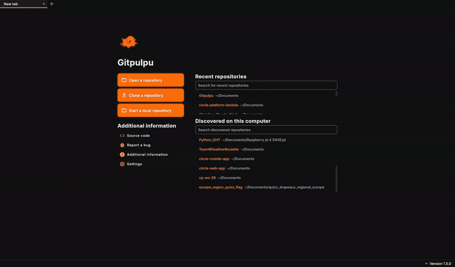

<div align="center">


# Gitpulpu

**A desktop Git client for Linux, Windows and macOS.**

Built with Compose Desktop and JGit. No account, no telemetry, no paid tier.

</div>



## What it does

Gitpulpu handles day-to-day Git work in a window instead of a terminal. It reads and writes
ordinary repositories — nothing is stored in a proprietary format, and you can go back to the
command line at any point.

- **Read history** — commit graph, blame, file history, and search by message, author or commit ID
- **Read changes** — syntax-highlighted diffs, side-by-side view, and image comparison
- **Stage precisely** — whole files, single hunks, or individual lines, with the same granularity for discarding
- **Commit** — commit, amend, revert, cherry-pick, reset
- **Branch** — create, rename, delete, checkout, merge, and rebase
- **Rewrite history** — interactive rebase with reorder, reword, squash, fixup, edit and drop
- **Resolve conflicts** — in-app, file by file or side by side
- **Sync** — clone, fetch, pull, push, force push, and upstream management
- **Organise** — tags, stashes, remotes and submodules, all from the side panel
- **Connect** — SSH keys and agent, HTTP credentials, and Git LFS

It is a fork of [Gitnuro](https://github.com/JetpackDuba/Gitnuro), which is where all of the above
comes from.

## What Gitpulpu adds

The fork is about interface and interaction — the same Git operations, with fewer dead ends.

- **Fewer blocked states** — switching branches with uncommitted changes stashes, checks out and pops for you, instead of refusing with a conflict dialog
- **Errors you can act on** — known failures (merge conflicts, auth problems, ref collisions, rejected pushes) explain what happened and offer the next step, rather than printing a stack trace
- **A way out of every state** — a banner across the top while a rebase, merge, cherry-pick or revert is in progress, with abort, skip and continue always reachable
- **Interactive rebase you can read** — colour-coded actions, visible commit hashes, drag handles, and dropped commits struck through
- **Large repositories open fast** — history loads incrementally instead of blocking on the full log
- **Repositories found for you** — point it at a directory and the welcome screen lists the repositories inside
- **Reworked visual design** — a warm dark theme with a glow-line graph, and a light theme with layered cards, both tuned for long sessions

## Install

### Download

Prebuilt binaries are available on the [Releases](https://github.com/LaNeigeLuge/Gitpulpu/releases) page:

- **Linux** — JAR for x86_64 or aarch64. Requires Java 21+: `java -jar Gitpulpu-linux-x86_64-*.jar`
- **Windows** — installer (`.exe`) or portable ZIP. No Java required.
- **macOS** — ZIP with the app bundle. No Java required.

SHA256 checksums (`.sum`) are published next to each file.

## Build from source

### Requirements

- **JDK 17+** — [Adoptium](https://adoptium.net/) or your OS package manager. Gradle downloads the JDK 21 toolchain used for compilation automatically.
- **Rust** (`rustc` + `cargo`) — [rustup.rs](https://rustup.rs). Used to build the native SSH component in `rs/`.
- **cargo-kotars** — `cargo install cargo-kotars --git https://github.com/JetpackDuba/kotars`
- **Perl** — required to build the vendored OpenSSL. Preinstalled on Linux/macOS; on Windows use [Strawberry Perl](https://strawberryperl.com/).
- **git-lfs** — fonts are stored in Git LFS. Install it before cloning, or run `git lfs pull` after.

On Windows, Rust also requires the Visual Studio C++ Build Tools (installed via rustup).

### Linux / macOS

```bash
git clone https://github.com/LaNeigeLuge/Gitpulpu.git
cd Gitpulpu
./gradlew run
```

- Linux desktop launcher: `./install-desktop.sh`
- macOS app bundle: `./gradlew packageDmg` (output in `app/build/compose/binaries/main/dmg/`)

### Windows

```powershell
git clone https://github.com/LaNeigeLuge/Gitpulpu.git
cd Gitpulpu
.\gradlew.bat run
```

Installer: `.\gradlew.bat packageMsi` (output in `app\build\compose\binaries\main\msi\`)

## Build options

| Command | What it does |
| ------- | ----------- |
| `./gradlew run` | Run in dev mode (all platforms) |
| `./gradlew packageDmg` | macOS `.dmg` app bundle |
| `./gradlew packageMsi` | Windows `.msi` installer |
| `./gradlew packageDeb` | Linux `.deb` package |
| `./gradlew packageRpm` | Linux `.rpm` package |
| `./gradlew packageDistributionForCurrentOS` | Auto-detect your OS and package |

## Authentication (GitHub & GitLab)

Gitpulpu supports both **SSH** (recommended) and **HTTPS with a token**.

### SSH — automatic

Gitpulpu reuses your operating system's existing SSH setup. It reads your `~/.ssh/config`
and authenticates with your **ssh-agent and default keys** (`~/.ssh/id_ed25519`, `~/.ssh/id_rsa`,
or any `IdentityFile` you set in the config). There's nothing to configure inside the app — if
`git` works in your terminal over SSH, Gitpulpu works too.

If your key is protected by a passphrase, Gitpulpu asks for it the first time it's needed.

**Adding your SSH key (one-time setup):**

1. Create a key if you don't have one:

   ```bash
   ssh-keygen -t ed25519 -C "you@example.com"
   ```

2. Copy the **public** key:

   ```bash
   cat ~/.ssh/id_ed25519.pub
   ```

3. Add it to your host:
   - **GitHub** → Settings → SSH and GPG keys → **New SSH key** → paste
   - **GitLab** → Preferences → **SSH Keys** → paste

4. Clone using the SSH URL:

   ```text
   git@github.com:user/repo.git
   git@gitlab.com:user/repo.git
   ```

**Using a specific key or host** — because Gitpulpu honors `~/.ssh/config`, you can point a host
at a particular key (great for separate work/personal accounts):

```text
# ~/.ssh/config
Host github.com
    User git
    IdentityFile ~/.ssh/id_ed25519_personal

Host gitlab-work
    HostName gitlab.com
    User git
    IdentityFile ~/.ssh/id_ed25519_work
```

Then clone `git@gitlab-work:group/repo.git` to use the work key.

### HTTPS — with a personal access token

Clone with the `https://` URL. Gitpulpu will prompt for a **username** and **password**. Note that
GitHub and GitLab no longer accept your account password here — use a **Personal Access Token**:

- **GitHub** → Settings → Developer settings → Personal access tokens → generate one with `repo` scope
- **GitLab** → Preferences → Access Tokens → generate one with `write_repository` (or `api`) scope

Paste the token in the password field. Gitpulpu also honors any git **credential helper** configured
in your `.gitconfig`, so an existing setup (e.g. git-credential-manager) is reused automatically.

### Troubleshooting

- **"credential helper … cannot be executed"** — a helper using a shell prefix (`helper = !...`)
  can't be run by the underlying JGit engine. Use SSH, or configure a helper without the `!` prefix.
- **Authentication fails over SSH** — confirm it works in your terminal first: `ssh -T git@github.com`
  (or `git@gitlab.com`). If that fails, the issue is in your SSH setup, not Gitpulpu.

## Custom themes

Gitpulpu supports custom themes in JSON format via Settings. Example:

```json
{
  "primary": "FFFC5000",
  "primaryVariant": "FFFF8A50",
  "onPrimary": "FFFFFFFF",
  "secondary": "FF7B74FF",
  "onSecondary": "FFFFFFFF",
  "onBackground": "FFF0EFEB",
  "onBackgroundSecondary": "FFB0AEA8",
  "error": "FFD03030",
  "onError": "FFFFFFFF",
  "background": "FF121214",
  "backgroundSelected": "FF3D2C15",
  "surface": "FF1C1C20",
  "secondarySurface": "FF262630",
  "tertiarySurface": "FF2E2822",
  "addFile": "FF2E8C48",
  "deletedFile": "FFD03030",
  "modifiedFile": "FFFC5000",
  "conflictingFile": "FFD88020",
  "dialogOverlay": "AA000000",
  "normalScrollbar": "FF555550",
  "hoverScrollbar": "FFFC5000",
  "diffLineAdded": "AA3A5038",
  "diffLineRemoved": "AA5A3838",
  "diffContentAdded": "4530A030",
  "diffContentRemoved": "45C03030",
  "diffKeyword": "FFA0CAF0",
  "diffAnnotation": "FFD0CC60",
  "diffComment": "FF70C290",
  "isLight": false
}
```

Colors are in ARGB hex format.

## Contributing

Issues and pull requests are welcome. For new features, please open an issue first to discuss the approach.

See [DEVELOPMENT.md](DEVELOPMENT.md) for development setup.

## Credits

Built on [Gitnuro](https://github.com/JetpackDuba/Gitnuro) by JetpackDuba.

## License

Licensed under the same terms as the original Gitnuro project.
